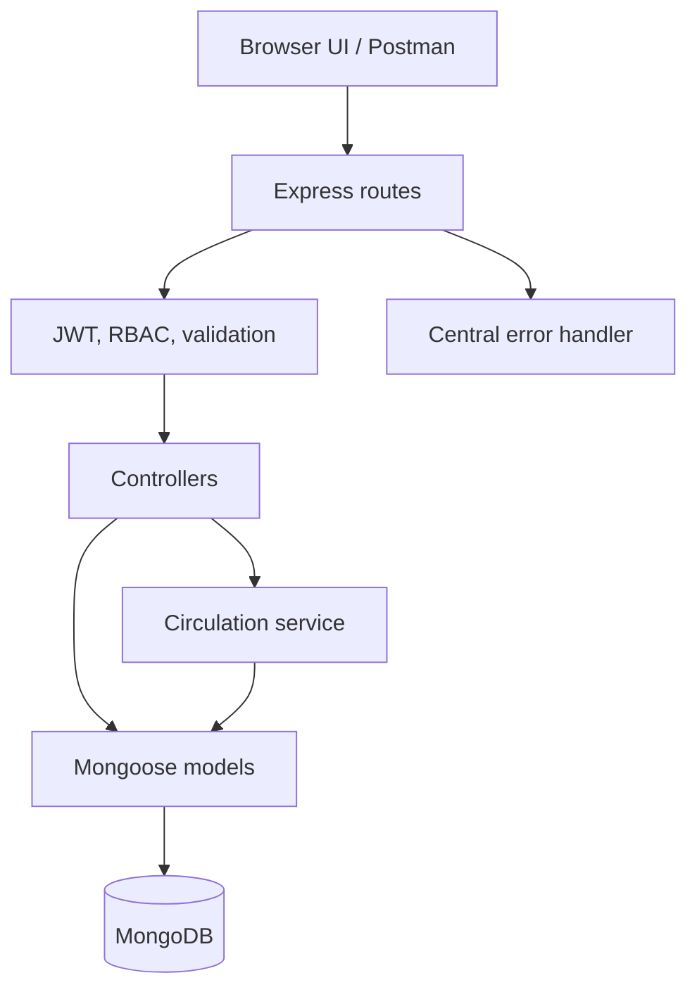
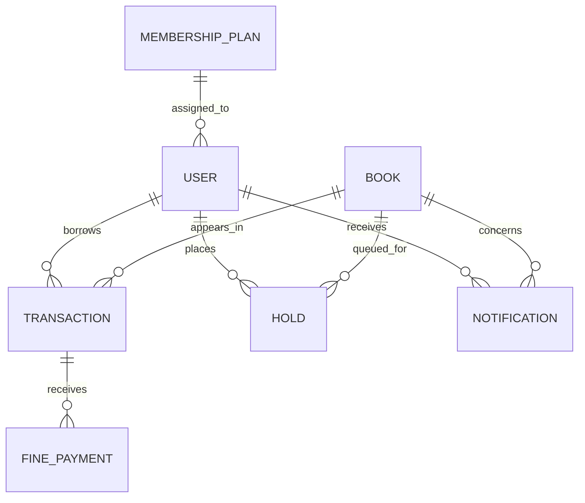

# Digital Library Management System

A complete CIA-3 backend project for a university library. It replaces manual registers with a secure catalog, member authentication, lending workflow, reservations, overdue fines, inventory tracking, notifications, and administrator reports. A responsive browser interface is included and is served by the same Express application.

## Team details

| Name | Roll number | Department | Section |
|---|---:|---|---|
| Dan Abraham Jose | 2463017 | B.Tech Artificial Intelligence & Machine Learning | 5BTAIML |
| Diya Susan Binu  | 2463019 | B.Tech Artificial Intelligence & Machine Learning | 5BTAIML |
| Doylin Jovita J  | 2463068 | B.Tech Artificial Intelligence & Machine Learning | 5BTAIML |


> Replace the placeholder rows before submission.

## Problem statement

Manual library registers make it difficult to know which books are available, enforce different student/faculty borrowing limits, identify overdue loans, maintain a fair hold queue, and produce reliable reports. This system centralizes those operations in MongoDB and exposes them through validated, role-protected REST APIs. It also provides a simple live interface for demonstrating the complete workflow.

## Highlights

- JWT authentication with bcrypt password hashing and role-based access control.
- Full catalog CRUD and partial search across title, author, ISBN, and category.
- Business-rule-driven issue/return workflow—not plain CRUD.
- Atomic copy reservation when a book is issued.
- Membership-specific loan periods, limits, grace periods, and daily fine rates.
- FIFO hold queue with ready windows, expiry, and notifications.
- Good, damaged, and lost return conditions reflected in inventory.
- Partial fine payments, reversals, and librarian/admin waivers.
- Overdue notification records with daily deduplication.
- Member histories and librarian reports for popularity, overdue loans, inventory, and fines.
- Central validation and consistent JSON error handling.
- Responsive vanilla HTML/CSS/JavaScript demonstration UI.
- Seed data, unit tests, endpoint documentation, and a complete Postman collection.

## Technology stack

| Layer | Technology |
|---|---|
| Runtime | Node.js 20+ |
| API | Express.js 5 |
| Database | MongoDB with Mongoose ODM |
| Authentication | JSON Web Tokens and bcryptjs |
| Validation | express-validator + Mongoose validation |
| Security | Helmet, CORS allowlist, rate limiting |
| Frontend | HTML5, modern CSS, vanilla JavaScript |
| Tests | Node.js built-in test runner |
| API client | Postman collection included |

## Implemented modules

| # | Required module | Implementation |
|---:|---|---|
| 1 | Member Registration & Authentication | Registration, generated membership IDs, login, profile, password change |
| 2 | Book Catalog Management | Librarian/admin create, read, update, archive |
| 3 | Catalog Search & Filtering | Title/author/ISBN keyword, category, availability, sorting |
| 4 | Book Issue Workflow | Staff issue and optional member self-borrow with limit/stock/hold checks |
| 5 | Book Return & Fine Calculation | Due date, grace days, daily fine, good/damaged/lost condition |
| 6 | Reservation/Hold Queue | FIFO queue, ready status, expiry, cancel, fulfilment |
| 7 | Membership Plans & Limits | Separate configurable plans for students/faculty |
| 8 | Fine Payment Tracking | Partial/full payment records and admin reversal |
| 9 | Overdue Notification Records | Daily deduplicated overdue reminders plus hold/fine notifications |
| 10 | Inventory & Copy Management | Total/available/borrowed/lost/damaged counts and adjustment actions |
| 11 | Member Borrowing History | Full timeline and fine/loan summary per member |
| 12 | Librarian/Admin Reports | Dashboard, popular books, overdue, inventory health, fine summary |
| 13 | Role-Based Access Control | Member, librarian, and admin route restrictions plus ownership checks |

## Architecture



## Collection relationships



### Reference vs. embedding decisions

- `book`, `member`, and staff IDs are references because those records are shared and updated independently.
- Fine totals are embedded inside a transaction because they are small and nearly always read with that loan.
- Every individual fine payment is referenced through its own collection because payments have an independent audit lifecycle and can be reversed.
- A transaction stores a snapshot of `loanDays`, `finePerDay`, and `graceDays`. Later edits to a membership plan therefore do not retroactively change an already-issued loan.
- Aggregate copy counts are embedded in each book because availability is queried constantly and each count belongs to one title.

## Quick start

### 1. Prerequisites

- Node.js 20 or newer
- npm
- MongoDB 7 locally, with Docker, or a MongoDB Atlas connection string

### 2. Install

```bash
npm install
```

### 3. Configure environment

Copy `.env.example` to `.env`.

Windows PowerShell:

```powershell
Copy-Item .env.example .env
```

macOS/Linux:

```bash
cp .env.example .env
```

At minimum, set:

```env
MONGO_URI=mongodb://127.0.0.1:27017/digital_library
JWT_SECRET=use_a_long_random_value_of_at_least_32_characters
```

Never commit `.env`.

### 4. Start MongoDB

If MongoDB is installed locally, start its service. Or use the included Docker Compose file:

```bash
docker compose up -d
```

### 5. Seed plans, accounts, settings, and sample books

```bash
npm run seed
```

With `SEED_DEMO_DATA=true`, the demo accounts are:

| Role | Email | Password |
|---|---|---|
| Admin | `admin@library.local` | Value in `ADMIN_PASSWORD` (`ChangeMe123!` in the sample) |
| Librarian | `librarian@library.local` | `Library123!` |
| Member | `student@library.local` | `Student123!` |
| Faculty member | `faculty@library.local` | `Faculty123!` |

Change all seeded passwords before using the project outside a classroom demonstration.

### 6. Run

Development mode:

```bash
npm run dev
```

Normal mode:

```bash
npm start
```

Open `http://localhost:4000`. The API health check is `http://localhost:4000/api/health`.

## Core demo journey

1. Run the seed script and sign in as the demo member.
2. Search the catalog and borrow an available book.
3. Try borrowing the same title again to demonstrate duplicate-loan protection.
4. Sign in as the librarian and issue another title to a member.
5. Return it with a custom overdue date through Postman to demonstrate fine calculation.
6. Record a partial or complete fine payment.
7. Make all copies of a title unavailable and place a member hold.
8. Return a good copy and show the first hold becoming ready.
9. Generate overdue notifications and view the overdue report.
10. Sign in as admin to create staff, edit plans, change settings, and disable accounts.

## API overview

All protected requests use:

```http
Authorization: Bearer <jwt-token>
Content-Type: application/json
```

| Area | Method and path | Minimum role |
|---|---|---|
| Auth | `POST /api/auth/register`, `POST /api/auth/login` | Public |
| Profile | `GET/PUT /api/auth/me`, `PUT /api/auth/change-password` | Any signed-in user |
| Catalog | `GET /api/books`, `GET /api/books/search` | Public |
| Catalog management | `POST/PUT/DELETE /api/books...` | Librarian |
| Inventory | `PATCH /api/books/:id/inventory` | Librarian |
| Self-borrow | `POST /api/transactions/borrow` | Member |
| Desk issue | `POST /api/transactions/issue` | Librarian |
| Return | `PUT /api/transactions/:id/return` | Owner or librarian |
| Holds | `POST /api/holds`, `GET /api/holds/my` | Member |
| Hold management | `GET /api/holds`, status/expiry routes | Librarian |
| Member history | `GET /api/members/:id/history` | Owner or librarian |
| Fine payment | `POST /api/fine-payments` | Librarian |
| Fine waiver | `PUT /api/transactions/:id/waive-fine` | Librarian |
| Reports | `GET /api/reports/...` | Librarian |
| Staff and account administration | `/api/admin/users...` | Admin |
| Plans and settings updates | `/api/membership-plans`, `/api/settings` | Admin |

See [docs/API.md](docs/API.md) for every endpoint and example payload.

## Business rules enforced

- Only active member accounts can receive a loan.
- The member cannot exceed the maximum books in their assigned plan.
- A member cannot have two active loans for the same title.
- A book must have at least one available copy; copy deduction uses an atomic conditional update.
- An active hold queue takes priority over a non-queued borrower.
- Holds can normally be placed only when no unreserved copy is immediately available.
- Returns cannot be processed twice.
- Fine rules are the exact plan snapshot captured on the issue date.
- A damaged/lost return does not increase available copies.
- Payments and waivers cannot exceed the outstanding fine balance.
- A title with an active loan cannot be archived.
- Members can view or modify only records they own.
- Admins cannot disable themselves or change their own role.

## Inventory actions

Send `PATCH /api/books/:id/inventory` with a positive integer `quantity` and one action:

- `add`: increases total and available copies.
- `remove`: removes available copies from the catalog.
- `mark-lost`: moves available copies to the lost count.
- `mark-damaged`: moves available copies to the damaged count.
- `repair-damaged`: returns damaged copies to availability.
- `recover-lost`: returns found copies to availability.

## Standard responses

Success:

```json
{
  "success": true,
  "message": "Book issued successfully",
  "data": {}
}
```

Validation or business-rule error:

```json
{
  "success": false,
  "message": "Request validation failed",
  "errorCode": "VALIDATION_ERROR",
  "details": [
    { "field": "bookId", "message": "bookId must be a valid MongoDB ObjectId" }
  ]
}
```

## Testing and validation

```bash
npm test
npm run check
```

- `npm test` verifies fine calculation, grace periods, decimal rates, date behavior, and pagination.
- `npm run check` syntax-checks all JavaScript and parses every JSON file.
- Import `postman/Digital-Library.postman_collection.json` and run requests in sequence for API-level testing.

The collection automatically saves tokens and created record IDs into collection variables.

## Folder structure

```text
digital-library-management-system/
├── config/             MongoDB connection and constants
├── controllers/        HTTP request handlers
├── docs/               API and demo documentation
├── middleware/         JWT, RBAC, validation, error handling
├── models/             Mongoose collection schemas
├── postman/            Importable collection and environment
├── public/             Responsive demonstration frontend
├── routes/             REST route definitions
├── scripts/            Seed, checks, and support scripts
├── services/           Cross-model circulation business logic
├── tests/              Unit tests
├── utils/              Reusable helpers
├── validators/         Server-side request validation
├── .env.example
├── app.js
├── docker-compose.yml
├── package.json
└── server.js
```

## Deployment note

The frontend is served by Express, so one Node web service can host the entire project. On Render/Railway, set the build command to `npm install`, the start command to `npm start`, and configure `MONGO_URI`, `JWT_SECRET`, `CLIENT_ORIGIN`, and `NODE_ENV=production`. Do not run the seed script automatically in production. If the frontend and backend are separated later, set `CLIENT_ORIGIN` to the exact deployed frontend URL and make the frontend API base URL configurable.

## Known limitations

- Email/SMS delivery and a real payment gateway are intentionally represented as auditable database records.
- Copy tracking is aggregate per title rather than barcode-per-copy.
- Hold notifications are shown in the application rather than sent externally.
- The demo interface covers the main evaluator journey; Postman exposes every API operation.
- MongoDB replica-set transactions are not required. Critical stock deduction is still atomic and compensates if transaction creation fails.

## Submission checklist

- [ ] Replace placeholder team details.
- [ ] Change secrets and demo passwords.
- [ ] Push the unzipped project to GitHub with meaningful commits from all members.
- [ ] Import the Postman collection and capture successful/error response screenshots.
- [ ] Capture UI screenshots for member, librarian, admin, catalog, returns, and reports.
- [ ] Add architecture/ER diagrams and screenshots to the PPT/report.
- [ ] Rehearse the end-to-end demo and business-rule explanations.

## License

MIT—suitable for academic use and extension.
